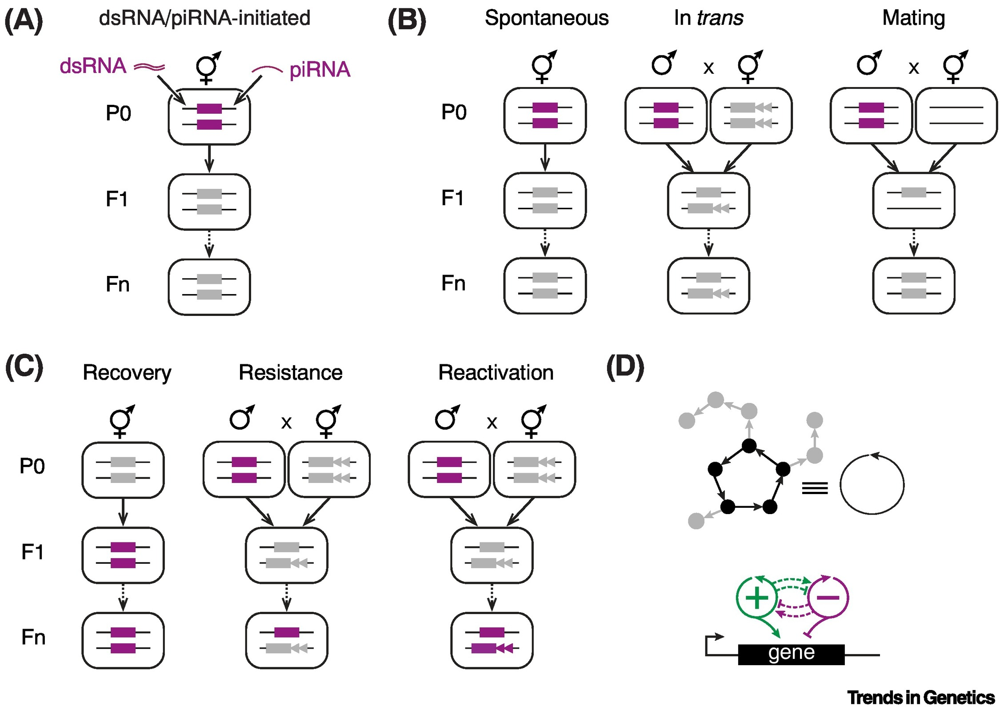

+++
title = "Heritable epigenetic changes at single genes: challenges and opportunities in C. elegans"
authors = ["Mary Chey", "Antony M Jose"]
aliases = ["10.1016/j.tig.2021.08.011"]
description = ""
sort_by = "title"

[extra]
key_words = ["RNA interference (RNAi)", "transgenerational epigenetic inheritance (TEI)", "regulatory networks"]
see_also = [
  { title = "10.1016/j.tig.2021.08.011" },
  { title = "Article", href = "/doi/10.1016/j.tig.2021.08.011.pdf" },
]
+++

{{ hidden() }}

# Glossary

**Perdurance**
: Continuation of existence, endurance, especially for a great length of time.

**Heritable Epigenetic Changes**
: "Changes that occur in biological molecules and/or their arrangements that are transmitted 
across generations without altering the genome sequence. Past definitions have been 
similarly broad or narrower with a focus on particular chemical modifications (e.g., DNA 
methylation) or changes in regulators (e.g., small RNAs). The concepts outlined here apply 
to both types of definitions"

**Paramutation**
: "A gene silencing phenomenon, initially identified in maize, whereby one allele can induce 
heritable changes in another allele at the same locus"

**Piwi-interacting RNA**
(piRNA)
: "A class of small RNA that is processed from RNA transcribed within the germline, binds 
the Piwi subfamily of Argonaute proteins, and base pairs with complementary mRNAs, 
typically resulting in gene silencing"

**RNAe**
: "RNA-induced epigenetic silencing that can last for many generations. This term was initially 
used to describe the silencing of single-copy transgenes within the _C. elegans_ germline 
through a mechanism that requires piRNA binding. Discovery of distinct phenomena 
that share some aspects of piRNA-mediated silencing suggest a diversity of underlying 
mechanisms"

# Abstract
Organisms rely on stereotyped patterns of gene expression for similar form and function in 
every generation. The analysis of epigenetic changes in the expression of different genes across 
generations can provide the rationale for measured actions in one generation that consider impact 
on future generations.

# Content
Organisms develop in each generation using heritable information stored in gene 
sequences, gene regulators, and their arrangements[^1]. Regulators can interact to form 
different networks that have different architectures. Faithful recreation of such regulatory 
architectures, the interacting regulators, and the genome are all required for the preservation 
of form and function across generations in a given environment.

Changes that do not alter the sequence information in genomes but are nevertheless 
transmitted across generations are broadly considered [heritable epigenetic changes](#glossary) 
and are poorly understood. Epigenetic changes can be driven by changes in 
the environment and occur within the context of a complex network of interacting 
molecules. Cases that alter either physical/chemical properties of the molecules or only 
alter interactions have been documented[^2][^3]. However, excluding inadvertent selection of a 
pre-existing genetic difference, constructing explanations that account for all aspects of the 
heritable effect, and developing models that can predict heritable epigenetic effects remain 
challenges.

To begin addressing these challenges, epigenetic changes associated with the expression 
of single genes could be analyzed across generations with the ultimate goal of developing 
an aggregate model that can predict heritable effects at any gene. Providing molecular 
explanations for heritable epigenetic effects requires answers to three key questions:

##### 1. How many generations does the effect last?
- Heritable changes can be classified into three broad categories based on their duration: 

  **Parental or Grandparental Effects**
  : Which last one or two generations, respectively, and can be the result 
  of passive mechanisms in parents enabling perdurance of regulatory molecules 
  or active mechanisms in descendants that restrict further transmission.

  **Unstable Heritable Effects**
  : Which last for a few generations, before opposing mechanisms or dilution of the change cause return to initial states.

  **Stable Heritable Effects** 
  : Which can potentially last forever.

##### 2. What regulatory molecules are required for the observed effects in each generation?
- Molecules can change in abundance (e.g., decrease in mRNA levels), 
in chemical composition (e.g., methylation of histones), 
or physical structure (e.g., folding of prions) for the duration of a heritable epigenetic effect, 
making them either essential components or byproducts of the mechanism transmitting the change across generations.

##### 3. Which regulatory interactions explain the nature and the duration of the effect?
- Regulatory architectures created by a network of interacting molecules can 
persist, despite turnover of individual molecules, if the information necessary 
for all interactions is preserved in the remainder of the network. Therefore, 
explaining the origin and eventual loss or permanent gain of a new regulatory 
architecture is needed to account for the nature and duration of a heritable 
epigenetic effect.

The nematode _C. elegans_ is a well-characterized animal with a generation time of three days, 
making it useful for analyzing effects that can last for many generations. Here, we highlight 
advances that have been made towards the explanation of heritable epigenetic changes in the 
expression of single genes in C. elegans, and outline the opportunities and challenges that 
remain.

## Expressed genes can become stably silenced

Recurrent expression of a gene in every generation requires the information for driving 
such expression to be reliably inherited from parent to progeny. Changing this heritable 
epigenetic information can alter the expression of the gene for many generations. Here, we 
highlight five different ways of causing stable RNA silencing of single genes in _C. elegans_ – 
two use molecularly defined RNAs to initiate silencing and three rely on, as yet, undefined 
molecular initiators.

##### Stable RNA silencing induced by well-defined initiators.
Silencing that can last for multiple generations has been observed in response to double
stranded RNA (dsRNA) or piwi-interacting RNA (piRNA) ([Figure 1A](#figure-1), [^4][^5]). Gene 
silencing caused by dsRNA or piRNA is associated with changes in mRNA, production 
of RNA intermediates, and addition of chromatin modifications. This pathway for gene 
silencing provides several candidate molecules (e.g., modified mRNA fragments[^6], 
amplified small RNAs[^7], chromatin modifications[^8]) and interactions (e.g., between 
nascent RNA and small RNAs) that can act as heritable silencing signal(s). In principle, 
such signal(s) have three characteristics: they are selectively associated with specific gene 
sequences, can initiate gene silencing, and ensure transmission of a signal with the same 
capabilities to the next generation. Despite the diversity of candidates for heritable silencing 
signal(s), an unexplained feature of silencing by dsRNA or piRNA is that exposure to the 
same dsRNA or piRNA does not cause similarly persistent RNA silencing of all genes with 
matching sequences (e.g.,[^9]) ([see Box 1](#box-1)).

##### Stable RNA silencing induced by poorly defined initiators.

Spontaneous silencing, trans silencing, and mating-induced silencing require some of 
the same proteins and RNAs required for dsRNA- or piRNA-initiated silencing, but 
for which the factors that initiate the silencing and that dictate its duration are both 
unknown. Some single-copy transgenes are spontaneously silenced ([Figure 1B, left](#figure-1),[^10]) 
through a mechanism that requires complementary piRNA[^4][^5]. Understanding this form 
of silencing potentially requires the analysis of events that occur between injection of 
DNA into the germline and eventual integration of injected DNA into the genome. A 
gene that shows stable RNA silencing is associated with signal(s) that can silence other 
homologous sequences in trans ([Figure 1B, middle](#figure-1),[^11]). This trans silencing can last for 
many generations between some sequences with perfect homology (e.g.,[^9]), reflecting 
continuous production of sequence-specific silencing signal(s) from the stably silenced gene. 
Mating can cause stable RNA silencing of some transgenes when males expressing the 
transgene are mated with hermaphrodites lacking that transgene or homologous sequences 
([Figure 1B](#figure-1), right,[^9]). The persistence of such mating-induced silencing relies on RNA
based regulation and positive feedback loops.

## Silenced genes can become stably expressed
Gain of new epigenetic changes or loss of previous epigenetic changes (i.e., epigenetic 
recovery) can cause a silenced gene to become expressed. Here we highlight three such 
gene expression phenomena where transitions from silenced to expressed states have been 
observed, but the underlying causal mechanisms are unknown.

**Spontaneous Expression**
: A gene that has been silenced for multiple generations can spontaneously regain expression ([Figure 1C, left](#figure-1), e.g.,[^9]). 
: - Such recovery from silencing could occur because of the loss of heritable silencing signal(s) and/or the gain of opposing epigenetic changes. 

**Recovered Expression**
: A gene that was once silenced in trans by a stably silenced gene can recover expression and then remain expressed despite the presence of the stably silenced gene in the same nucleus ([Figure 1C, middle](#figure-1), e.g.,[^9]). 
: - Such resistance to trans silencing could occur because of changes in the regulation of the newly silenced gene or the stably silenced gene. 

**Recombination Expression**
: An expressed gene can activate the expression of a homologous gene that has remained stably silenced for many generations when the two genes are brought together through a genetic cross ([Figure 1C, right](#figure-1),[^11]). 
: - Such reactivation is likely driven by sequence-specific signal(s) from the expressed gene.

## Heritable epigenetic changes persist as part of regulatory architectures that include loops
The indefinite persistence of any process (e.g., metabolism) requires at least one closed loop 
of mutual production [^2][^12][^13][^14] ([Figure 1D, top](#figure-1)). This requirement implies that the positive 
regulators of a gene that is expressed in every generation need to form at least one closed 
loop. Gene silencing phenomena such as paramutation[^15], RNAe[^4][^5], mating-induced 
silencing[^9], etc., that appear capable of persisting forever reveal that the negative regulators 
of the silenced gene also form at least one closed loop. Alternatively, both positive and 
negative regulators could be part of the same closed loop.

A transient change in the amount of one regulator could be propagated to all other regulators 
in a closed loop if the induced change in the amount of every regulator is greater than that 
required to change the next regulator in the loop[^2]. Such an overall increase in the activity 
of the loop(s) formed by positive or negative regulators will result in the permanence of 
new expression or silencing, respectively ([Figure 1D, bottom](#figure-1)). When a transient change in 
an interaction between the loops is propagated to all other regulators in one of the closed 
loops (positive or negative), the activity of that loop could permanently change relative to 
the other loop ([dotted lines in Figure 1D, bottom](#figure-1)). Finally, transient changes in the inputs 
regulating the gene ([arrow or bar to the gene in Figure 1D, bottom](#figure-1)) can only be sustained 
if that regulator is part of a closed loop ([black in Figure 1D, top](#figure-1)) and not if it is one of the 
regulators emanating from the loop ([grey in Figure 1D, top](#figure-1)).

## Concluding Remarks
Examining changes in the expression of genes across generations holds promise for 
making rapid progress towards understanding heritable epigenetic effects. In C. elegans, 
RNA-mediated changes in gene expression have enabled such analyses at single-gene 
resolution. Given the incomplete knowledge of molecular changes underlying any heritable 
effect, preserving information about how the effect arose is necessary for effective analysis. 
Models that successfully explain both the nature and the duration of a heritable epigenetic 
effect will include loss or gain of a heritable regulatory architecture. Arriving at such 
molecular explanations for diverse heritable epigenetic effects at any gene is needed for 
equal understanding of genetic predisposition and epigenetic predisposition.

# Figures

##### Figure 1. 
##### Heritable epigenetic changes in _C. elegans_ and the regulatory architectures that support them.

**(A)**
: Heritable gene silencing caused by known molecular initiators. Some expressed genes 
(magenta box) can be silenced (grey box) for many generations (F1 through Fn) using 
dsRNA of matching sequence or piRNA of complementary sequence. 

**(B and C)**
: Heritable epigenetic changes caused by unknown molecular initiators. Chromosomes without a 
transgene (line) and with expressed (magenta) or silenced (grey) transgenes that have 
unique (arrowheads) and/or shared (box) sequences when compared with other homologous 
transgenes are indicated. 

**(B)**
Heritable Gene Silencing
: _Left_, Spontaneous silencing. 
: _Middle_, Trans silencing. 
: _Right_, Mating-induced silencing. 

**(C)**
Heritable Gene Expression
: _Left_, Recovery of expression. 
: _Middle_, Resistance to silencing. 
: _Right_, Reactivation of expression. 
: In every case, the epigenetic changes can persist for many generations (Fn). See text for details. 

**(D)**
: Regulatory architectures needed to explain heritable epigenetic changes that can persist forever. 
: _Top_, At least one closed loop of mutual production (black circles 
and arrows) is needed for the indefinite persistence of regulators (black or grey circles) 
and their interactions. Depiction of multiple regulators (circles) and their interactions 
(arrows), including a closed loop (black), and the equivalent (≡) simplification. 
: _Bottom_, Schematic depicting regulatory interactions that control heritable epigenetic changes. 
Evidence suggests that positive regulators (green, +) and negative regulators (magenta, -) minimally form two separate closed loops. Additional interactions (dotted lines) could 
connect both loops (positive, arrow; negative, bar) into a single heritable network.

##### Box 1

> [!NOTE]
> Mutations and epimutations are used as descriptors for genetic and epigenetic change, 
respectively. However, while genetic changes are precisely described as altered genome 
sequences (e.g., A to C, deletion of 100 bp, etc.), epigenetic changes are incompletely 
described at the molecular level. For example, a variety of different molecular changes 
that result in reduced expression could be described as ‘silencing’. Since epigenetic 
changes can be distributed among many molecules and their arrangements[^2], technical 
limitations typically preclude their complete description. Furthermore, phenomena that 
can be distinguished by their duration nevertheless can depend on some of the 
same molecules[^9]. Thus, effective analysis requires the silenced or expressed states 
generated through different means to be at least provisionally considered as distinct. For 
example, for analyzing a _C. elegans_ gene, the nomenclature could be gene(lab#1){Epi-gene(lab#2)}, where lab designates the laboratory of origin, #1 is a number indicating the 
genetic state and #2 is a number indicating both the epigenetic state and the sequence 
of events that led to it. This conservative assumption of differences between epigenetic 
states despite shared requirements for a few regulators aids the discovery of causal 
explanations.
>> Box 1: Analysis of heritable epigenetic changes requires nomenclature that preserves history

# References

[^1]: Jose AM. (2020). A framework for parsing heritable information. J. R. Soc. Interface 17: 20200154. [PubMed: 32315573] 
[^2]: Jose AM. (2020). Heritable Epigenetic Changes Alter Transgenerational Waveforms Maintained by Cycling Stores of Information. Bioessays 42(7):e1900254. [PubMed: 32319122] 
[^3]: Cavalli G and Heard E (2019). Advances in epigenetics link genetics to the environment and disease. Nature 571, 489–499. [PubMed: 31341302] 
[^4]: Frolows N, and Ashe A (2021). Small RNAs and chromatin in the multigenerational epigenetic landscape of Caenorhabditis elegans. Philos Trans R Soc Lond B Biol Sci 376(1826):20200112. [PubMed: 33866817] 
[^5]: Ketting RF, and Cochella L (2021). Concepts and functions of small RNA pathways in C. elegans. Curr Top Dev Biol 144:45–89. [PubMed: 33992161] 
[^6]: Shukla A, Yan. J, Pagano. DJ, Dodson AE, Fei Y, Gorham J, Seidman JG, Wickens M, Kennedy S (2020) poly(UG)-tailed RNAs in genome protection and epigenetic inheritance. Nature 582(7811):283–288. [PubMed: 32499657] 
[^7]: Buckley BA, Burkhart KB, Gu SG, Spracklin G, Kershner A, Fritz H, Kimble J, Fire A, and Kennedy S (2012). A nuclear Argonaute promotes multigenerational epigenetic inheritance and germline immortality. Nature 489(7416):447–51. [PubMed: 22810588] 
[^8]: Gu SG, Pak J, Guang S, Maniar JM, Kennedy S, and Fire A (2012). Amplification of siRNA in Caenorhabditis elegans generates a transgenerational sequence-targeted histone H3 lysine 9 methylation footprint. Nat Genet 44(2):157–64. [PubMed: 22231482] 
[^9]: Devanapally S, Raman P, Chey M, Allgood S, Ettefa F, Diop M, Lin Y, Cho YE, and Jose AM (2021). Mating can initiate stable RNA silencing that overcomes epigenetic recovery. Nat. Commun 12(1):4239. [PubMed: 34244495] 
[^10]: Frøkjaer-Jensen C, Davis MW, Hopkins CE, Newman BJ, Thummel JM, Olesen SP, Grunnet M, and Jorgensen EM (2008). Single-copy insertion of transgenes in Caenorhabditis elegans. Nat Genet 40(11):1375–83. [PubMed: 18953339] 
[^11]: Shirayama M, Seth M, Lee HC, Gu W, Ishidate T, Conte. D Jr., and Mello CC (2012). piRNAs initiate an epigenetic memory of nonself RNA in the _C. elegans_ germline. Cell 150(1):65–77. [PubMed: 22738726] 
[^12]: Eigen M (1971). Selforganization of matter and the evolution of biological macromolecules. Naturwissenschaften 58(10):465–523. [PubMed: 4942363] 
[^13]: Kauffman SA (1971). Cellular homeostasis, epigenesis and replication in randomly aggregated macromolecular systems. J. Cybern 1, 71–96.
[^14]: Varela FG, Maturana HR, and Uribe R (1974). Autopoiesis: the organization of living systems, its characterization and a model. BioSystems 1974 May;5(4):187–96.
[^15]: Brink RA (1956). A genetic change associated with the R locus in maize which is directed and potentially reversible. Genetics 41, 872–889. [PubMed: 17247669]