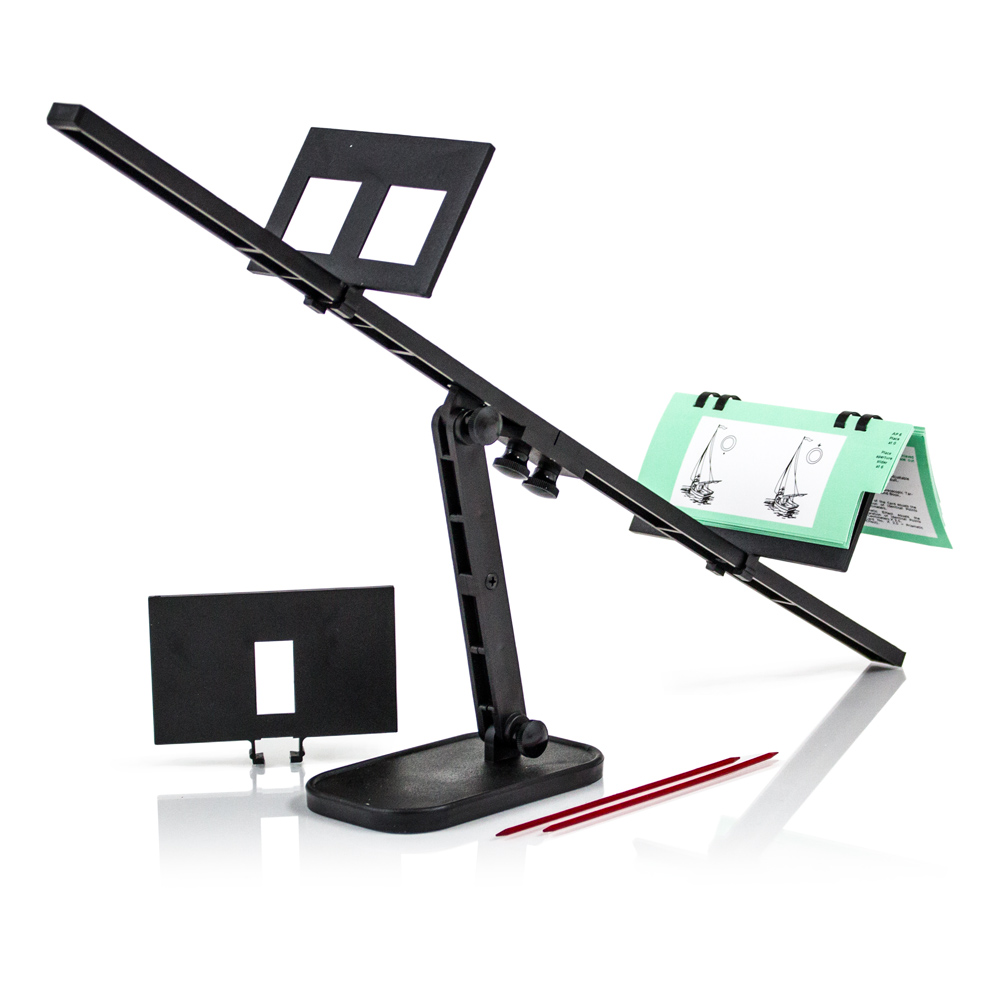

+++
title = "Vision Therapy"
description = "Physical therapy for your eyes."
aliases = ["vision-therapy", "vision_therapy"]
sort_by = "title"

[extra]
updated = 2027-01-01
site_version = 1
toc_level = 3
see_also = [
  { title = "Permalink", href = "/vision-therapy" },
  { title = "Vision Therapy Exercises", href = "https://aworkoutaday.com/exercises?StrengthMuscle=536870912" },
  { title = "Font Family: Optician Sans", href = "https://github.com/anewtypeofinterference/Optician-Sans" },
]
comments = [
  "Don't put any exercises here. Those should be linked to from each individual tool."
]
+++

{{ hidden() }}

# Vision Therapy Tools

**[Aperture Rule](/vision-therapy/aperture-rule)**
_Requires an Aperture Rule Trainer!_
: Image generator for an aperture rule trainer.

**[Arrow Chart](/vision-therapy/arrow-chart)**
: A chart of arrows for directional exercises.

**[Arrow Color Chart](/vision-therapy/arrow-color-chart)**
: A chart of colored arrows for decoding exercises.

**[Barrel Card](/vision-therapy/barrel-card)**
: ?

**[Closed/Open/Flat](/vision-therapy/closed-open-flat)**
: ?

**[Fusion Card](/vision-therapy/fusion-card)**
: ?

**[Hart Chart](/vision-therapy/hart-chart)**
: ?

**[Letter Saccades](/vision-therapy/letter-saccades)**
: ?

**[Letter Search](/vision-therapy/letter-search)**
: ?

**[Letter Tracking](/vision-therapy/letter-tracking)**
: ?

**[Line Counting](/vision-therapy/line-counting)**
: ?

**[Number Dots](/vision-therapy/number-dots)**
: ?

**[Number Grid](/vision-therapy/number-grid)**
: ?

**[Number Saccades](/vision-therapy/number-saccades)**
: ?

**[Number Search](/vision-therapy/number-search)**
: ?

**[Shape Chart](/vision-therapy/shape-chart)**
: ?

**[Shape Color Chart](/vision-therapy/shape-color-chart)**
: ?

**[Single Target](/vision-therapy/single-target)**
: ?

**[Slap Tap](/vision-therapy/slap-tap)**
: ?

**[Space Fixator](/vision-therapy/space-fixator)**
: ?

**[Spot the Match](/vision-therapy/spot-the-match)**
: ?

**[Stereo Circles](/vision-therapy/stereo-circles)**
: ?

**[Tranaglyph](/vision-therapy/tranaglyph)**
: ?

# Equipment

**Aperture Rule Trainer**

: An aperture rule trainer forces your eyes to see separate images using mechanical means.
: If a single aperture is used, your eyes are required to converge near the two images, creating a convergence demand in order to fuse the two images.
: If a double aperture is used, your eyes are required to converge distant the two images, creating a divergence demand in order to fuse the two images.

**Brock String**

: A string of beads.
: Position the first bead so it is 12 inches from the handle.
: Position the second bead so it is 5 feet from the handle.
: Position the third bead so it is 8 feet from the handle.
: > [!TIP]
  > Use an [Alpine Butterfly Loop Knot](https://www.animatedknots.com/alpine-butterfly-loop-knot) to create a back-stop for each bead threaded onto the string.

**Prism Lens**

: A triangular shaped lens that shifts the image from one eye inwards or outwards.
: **Base-In**
  Requires divergence.
  : The thick end of the lens (the base) should face towards your nose.
  : The image is shifted outwards—towards the small end of the lens (the apex).
  : - This requires your eyes to diverge and shift outwards as well to match and fuse the images.

  **Base-Out**
  Requires convergence.
  : The thick end of the lens (the base) should face away from your nose.
  : The image is shifted inwards—towards the small end of the lens (the apex).
  : - This requires your eyes to converge and shift inwards as well to match and fuse the images.

# About

## Visual Skills

**Eye Movement Control**
Oculomotility
: The ability to move both eyes together to point at an intended target or follow along a path.
: Includes saccades, pursuits, and vestibulo-ocular movements.

**Eye Teaming**
Binocularity
: The ability for each eye to send information to the brain and for the brain to combine it into one clear image.
: Poor eye teaming can result in blurred vision, moving print, reduced depth perception, and double vision.
: The brain may suppress information from one eye as an adaptation to reduce confusion.

**Convergence**
: The inward movement of the eyes to focus on an object at a close distance.

**Divergence**
: The outward movement of the eyes while looking at distant objects.

**Vergence**
: The ability to move both eyes together to focus on a specific point.
: Includes both convergence and divergence.

**Focus Accommodation**
: The ability to efficiently and quickly adjust focus between near and far distances.

**Depth Perception**
: The ability to judge whether objects are closer or farther away relative to other objects.

**Peripheral Vision**
: The ability to see objects to either side while looking straight ahead without moving your head.

**Gross-Motor Coordination**
: The ability to integrate visual information in order to move through space accurately and comfortably.

**Fine-Motor Coordination**
: The ability to integrate visual information in order to perform small, close-up activities with accuracy and comfort.

**Visual Motor Integration**
: The ability to coordinate body movements with visual information.
: Combines gross-motor and fine-motor coordination.

**Laterality and Directionality**
: Awareness that the body has two distinct sides (right and left).

**Visual Spatial Relations**
: The ability to understand directional concepts that organize external visual space.

**Visual Spatial Orientation**
: The ability to understand how the orientation of visual items affects spatial perception.

**Visual Spatial Skills**
: A broad set of abilities that enable understanding where we and objects are in space.
: Supports organizing and navigating through the environment.
: Includes laterality and directionality, visual spatial relations, and visual spatial orientation.

**Eye Movement Skills**
: A broad category encompassing eye movement control, eye teaming, convergence, divergence, focus accommodation, depth perception, peripheral vision, gross-motor coordination, fine-motor coordination, laterality and directionality, visual spatial relations, and visual spatial orientation.

**Visual Spatial Memory**
: The ability to recognize specific features of objects or forms, remember their locations in space, and understand their relationships to one another.

**Visual Sequential Memory**
: The ability to remember symbols or characters in the order they were seen.

**Visual Memory**
: The ability to readily recall characteristics of visually presented information.
: Includes both visual sequential memory and visual spatial memory.

**Visualization**
: The ability to create a mental picture or image.

**Figure Ground**
: The ability to distinguish an object from its background.

**Visual Closure**
: The ability to recognize a complete image even when only part of it is visible.

**Visual Form Recognition**
Visual Form Discrimination
: The ability to identify similarities and differences between objects or images.

**Visual Form Constancy**
: The ability to recognize or sort objects, shapes, symbols, letters, or words despite changes in size, orientation, or position.

**Visual Acuity**
: The measurement of how clearly we see at specific distances.

