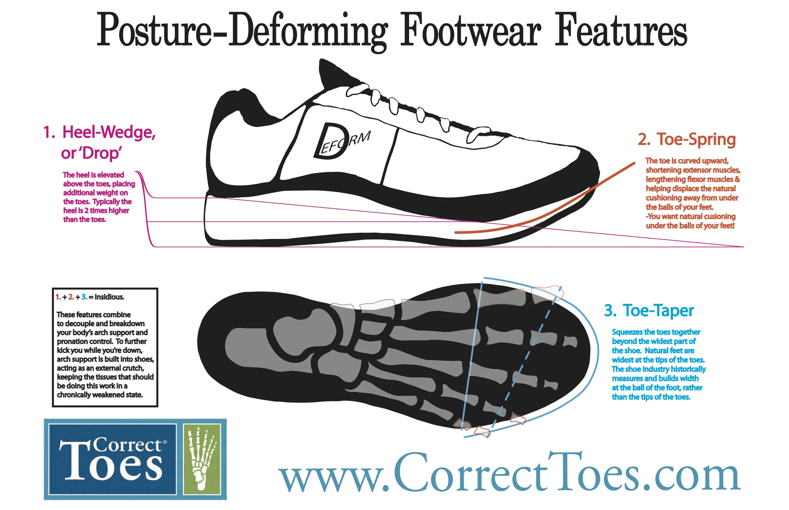

+++
title = "Shoes"
updated = 2026-09-01

[extra]
site_version = 1
toc_level = 2
see_also = [
  { title = "Thorlo Socks", href = "https://thorlo.com/" },
  { title = "K-Swiss Shoes", href = "https://kswiss.com/" },
  { title = "Correct Toes", href = "https://correcttoes.com/" },
  { title = "OOFOS", href = "https://www.oofos.com/" },
  { title = "On Cloud", href = "https://www.on.com/en-us/shop/shoes" },
  { title = "Altra Via Olympus 2", href = "https://www.altrarunning.com/en-us/road/mens-via-olympus-2/AL0A85NA.html" },
  { title = "Hoka Bondi 9", href = "https://www.hoka.com/en/us/mens-everyday-running-shoes/bondi-9/1162011.html" },
]
+++

{{ hidden() }}

# Shoes

Shoe Size
: US Men's 12
: Wide shoes — Need room for the toes to spread.

# Socks

Socks
: US Men's 12
: White Crew - Easier to spot ticks.
: Maximum Padding - For heel and metatarsal pain.

