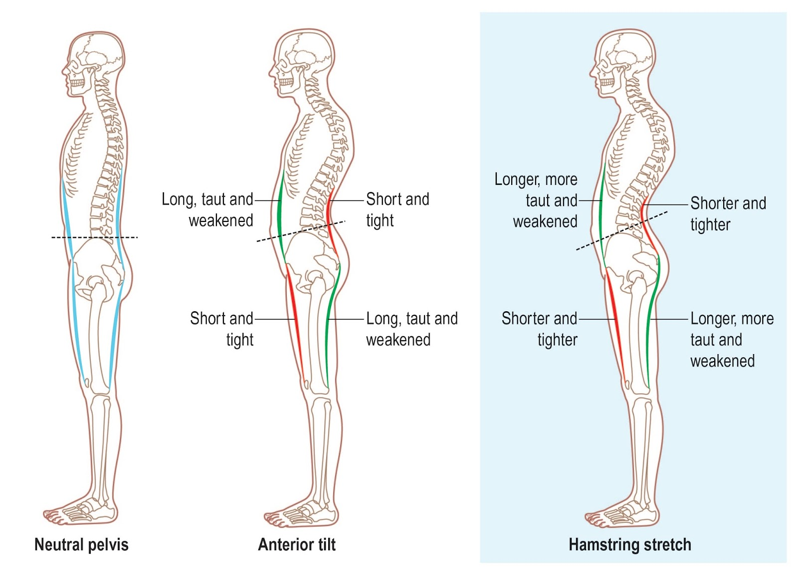

+++
title = "Posture"
updated = 2026-01-01

[extra]
see_also = [
  { title = "Exercise Library", href = "https://aworkoutaday.com/exercises" },
]
+++

# Anterior Pelvic Tilt
# _[Swayback Posture](https://mskneurology.com/really-assess-lumbar-lordosis-dispelling-fallacy-anterior-pelvic-tilt/)
This causes the lumbar spine to lean back to restore the center of gravity. Then the thoracic spine tilts forward to restore a horizontal chin position relative to the horizon. This makes it look like forward head posture is an issue; it may not be. 

##### How it Develops
Extended sitting is likely the culprit, which shortens and tightens the hip flexor muscles, pulling the pelvis forward.

##### How to Restore a Normal Posture 
Stretch and strengthen the hip flexors, strengthen the core muscles, and strengthen the glutes.

# Knock Knees

# Feet
Don't curl your toes to hold your balance, that will strain for planter fascia.
