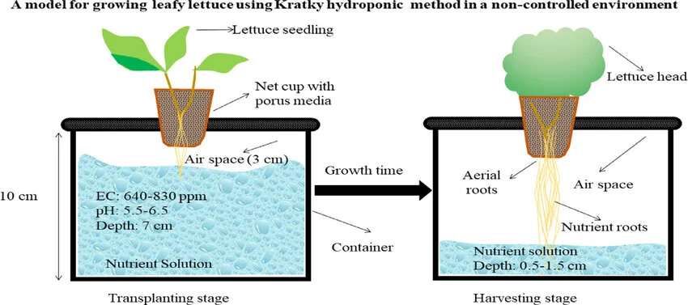

+++
title = "Infographics"
description = ""

[extra]
updated = 2026-06-01
site_version = 1
toc_level = 2
see_also = [
  { title = "Hydroponics Flyer", file = "hydroponic-lettuce.pptx" },
  { title = "Occurrence and Risk Assessment of Pesticides, Phthalates, and Heavy Metal Residues in Vegetables from Hydroponic and Conventional Cultivation", file = "foods-13-01151.pdf" },
  { title = "A simplified non-greenhouse hydroponic system for small-scale soilless urban vegetable farming", file = "A_simplified_non-greenhouse_hydroponic_system_for_.pdf" },
  { title = "Kratky B.A. Growing direct-seeded watercress by two non-circulating hydroponic methods. Vegetable crops. 2015 VC-7.", file = "VC-7.pdf" },
]
+++

{{ hidden() }}

<h1 class="title">Hydroponic Lettuce is Growing!</h1>

Community food projects help ensure communities have access to healthy food that is grown locally and sustainably.
The Webster Environmentalist Coalition grows food with the goal of building food security on campus via a community garden behind the Pearson house.
However, there exists a void around growing seasons when outdoor plants don't grow.
My goal is to expand on that by experimenting with a low-cost and scalable method of hydroponics to further develop food security on campus.

<h2 class="title">What is Hydroponics?</h2>

Hydroponics is a soil-less growing technique. 
In it, crops, usually vegetables, are grown suspended over a nutrient-rich water solution.
The plants absorb the nutrients they need from the nutrient solution. 
Anything else the plant needs, it can make from the sun through photosynthesis.
Because the plants are not grown in soil, they are generally protected from soil-bourne pests and diseases and can be grown without harsh pesticides.

Compared to conventional growing, hydroponics is regarded as a more sustainable and environmentally friendly method of growing crops.
Heavy metal contamination and pesticide use are both a frequent cause for concern in global food chains. 
In a suburban sample from China, 84% of vegetable samples grown using conventional methods contained pesticide residue.
In that same sample, a 16-fold increase in heavy metal concentrations was seen in conventional lettuce compared to hydroponic lettuce.[^1]

<h3 class="title">The Kratky Method</h3>

Our method of choice, the Kratky method, is one of the easiest and low-cost ways of growing hydroponic crops.
Named after Dr. Bernard Kratky, this hydroponic technique involves growing a crop through its entire lifecycle without the need for pumps or maintenance.[^3]
Enough nutrients and water are provided to the plant seedling at transplant that allows it to grow undisturbed until harvest. 

In the Kratky method, a plant is sown in a net cup above a container of nutrient-rich water. 
The seeds or transplanted seedlings are held in a porous medium, usually clay pebbles or rock wool.
This porous medium allows for air and water transfer to the roots before they fully develop.
As the plant grows, it absorbs the nutrient-rich water to support its growth, and air fills in the gap left by the water. 
The plant develops small air-roots that are used to take in enough oxygen from the air until harvest.
Little to no maintenance is necessary when using the Kratky method.
In fact, watering the plant halfway through could cause it to drown!
An air-gap is necessary to sustain cellular respiration in the plant's roots.

<h4 class="title">Our System</h4>

With proper food-safe materials, heavy metal contamination is not a risk. 
Here, we suspend plants in a food-safe, BPA-free, polypropylene plastic net cup[^4] inside of a glass mason jar.
Plants are held in the net cup by clay pebbles and a seed starter.
The brown paper bag is used to block out light to limit algae growth.
No pesticides or insecticides will be used in the cultivation of our plants. 

{{ extend(style="height:20px;") }}

  
  [^2]

<h2 class="title">Future Plans</h2>

The Kratky method was selected for it's low-cost, low-tech materials, and low-footprint.
Plans this summer are to see how viable growing hydroponic lettuce is on campus using this method.
For the future, there is potential to expand and distribute hydroponic growing kits around campus. 
If you are interested in growing your own leafy greens or herbs. 
Or if you have any questions, comments, or concerns, please contact <u>grahamscanlon@webster.edu</u>.

If you are interested in helping out with the webster community garden, please reach out to the Webster Environmentalist Coalition at <u>websterenvironmentalists@gmail.com</u>.

[^1]: Chen, S., Yao, C., Zhou, J., Ma, H., Jin, J., Song, W., & Kai, Z. (2024). Occurrence and Risk Assessment of Pesticides, Phthalates, and Heavy Metal Residues in Vegetables from Hydroponic and Conventional Cultivation. Foods (Basel, Switzerland), 13(8), 1151. https://doi.org/10.3390/foods13081151
[^2]: Gumisiriza, Margaret & Ndakidemi, Patrick & Mbega, Ernest. (2022). A simplified non-greenhouse hydroponic system for small-scale soilless urban vegetable farming. MethodsX. 9. 101882. 10.1016/j.mex.2022.101882. 
[^3]: Kratky B.A. Growing direct-seeded watercress by two non-circulating hydroponic methods. Vegetable crops. 2015 VC-7.
[^4]: https://acinfinity.com/mesh-net-cups-3-slotted-pots-with-wide-lips-25-pack/
